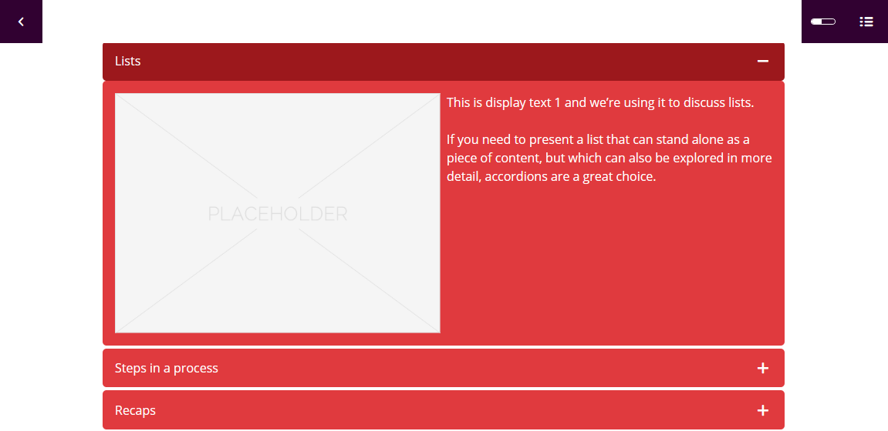

# adapt-askillt-theme

It provides specific values to styles, including colors, padding, margins, and assets such as fonts and background images.

## Installation

Download the ZIP and extract into the src > theme directory and run an appropriate Grunt task.

* If **ASKILLT** has been uninstalled from the Adapt authoring tool, it may be reinstalled using the [Plug-in Manager](https://github.com/Askillt-Solutions-India-Private-Limited/adapt_authoring/wiki/Plugin-Manager).

## Uninstallation

The Adapt framework does not allow the installation of more than one theme at a time. In order to replace **ASKILLT** it must be uninstalled. With the root of your framework installation as your current working directory, run the following command:
`adapt uninstall adapt-askillt-theme`

## Settings overview

Unlike most Adapt plug-ins, the **ASKILLT** theme has no attributes that are required to be configured in the course JSON files. There is, however, additional functionality available to apply background images and supporting styles for pages, articles and blocks as desired. These attributes are properly formatted as JSON in [*example.json*](https://github.com/Askillt-Solutions-India-Private-Limited/adapt-askillt-theme/blob/master/example.json) and available as configurable attributes in the Adapt authoring tool.

The **ASKILLT** theme also exposes [*colour variables*](https://github.com/Askillt-Solutions-India-Private-Limited/adapt-askillt-theme/blob/master/less/_defaults/colors.less) in the Adapt authoring tool for theme editing. This feature allows you to apply and save 'preset' theme styles.

**\_askillt** (object): The following attributes configure the defaults for **ASKILLT**. These include **\_backgroundImage**, **\_backgroundStyles** and **\_minimumHeights**. Global attributes are available at page, article and block level.

#### Global background image
>**\_backgroundImage** (object): The backgroundImage object that contains values for **\_large**, **\_medium** and **\_small**.

>>**\_large** (string): File name (including path) of the image used with large device width. Path should be relative to the *src* folder (e.g., *course/en/images/origami-menu-one.jpg*).

>>**\_medium** (string): File name (including path) of the image used with medium device width. Path should be relative to the *src* folder (e.g., *course/en/images/origami-menu-one.jpg*).

>>**\_small** (string): File name (including path) of the image used with small device width. Path should be relative to the *src* folder (e.g., *course/en/images/origami-menu-one.jpg*).

#### Global background image styles
>**_backgroundStyles** (object): Additional attributes available to customise how background images display. The backgroundStyles object contains values for **\_backgroundRepeat**, **\_backgroundSize** and **\_backgroundPosition**.

>>**\_backgroundRepeat** (string): This attribute defines how the background image repeats. Properties include **repeat**, **repeat-x**, **repeat-y** and **no-repeat**.
Repeat-x: The background image is repeated only horizontally. Repeat-y: The background image is repeated only vertically.

>>**\_backgroundSize** (string): This attribute defines the size the background image display. Properties include **auto**, **cover** and **contain**.
Auto: The background image is displayed in its original size. Cover: Resize the background image to cover the entire container, even if it has to stretch or crop the image. Contain: Resize the background image to make sure the image is fully visible.

#### Global minimum heights
>**_minimumHeights** (object): The minimum heights attribute group specifies the minimum height of the image container at different device widths (`_large`, `_medium`, and `_small`).

>>**\_large** (number): The minimum height should only be used in instances where the image container height needs to be greater than the content e.g. to prevent a background image being cropped.

>>**\_medium** (number): The minimum height should only be used in instances where the image container height needs to be greater than the content e.g. to prevent a background image being cropped.

>>**\_small** (number): The minimum height should only be used in instances where the image container height needs to be greater than the content e.g. to prevent a background image being cropped.

#### **contentObject.json**
>**\_pageHeader** (object): The backgroundImage object that contains values for **\_large**, **\_medium** and **\_small**.

>>**\_large** (string): File name (including path) of the image used with large device width. Path should be relative to the *src* folder (e.g., *course/en/images/origami-menu-one.jpg*).

>>**\_medium** (string): File name (including path) of the image used with medium device width. Path should be relative to the *src* folder (e.g., *course/en/images/origami-menu-one.jpg*).

>>**\_small** (string): File name (including path) of the image used with small device width. Path should be relative to the *src* folder (e.g., *course/en/images/origami-menu-one.jpg*).

#### **blocks.json**
>**_isDividerBlock** (boolean): - Determines whether the CSS class `is-divider-block` will be applied. Acceptable values are `true` and `false`.

Visit the [**ASKILLT** wiki](https://github.com/Askillt-Solutions-India-Private-Limited/adapt-askillt-theme/wiki) for more information about how to use and manipulate the theme.

## Structure

| Folder/File         | Description  |
| :-------------      |:-------------|
| 📁 js                | JavaScript files on which the theme depends |
| 📁 less              | Location of any [LESS](http://lesscss.org/) based CSS files |
| 📁 less/_defaults          | Location of configuration LESS files |
| 📄 less/_defaults/colors.less | Location of global colour variables   |
| 📁 less/core          | Location of Adapt Framework LESS file styles |
| 📁 less/plugins          | Location of Adapt plugin LESS file styles |
| 📁 less/project          | Location of additional LESS file styles |

## Templates

**ASKILLT** supports customisation for the rendering of various Adapt elements through the use of [Handlebars](http://handlebarsjs.com/) templates. The file name of the template indicates the element it affects.

## Limitations

No known limitations.

----------------------------
**Version number:**  0.1.0  
**Framework versions:**  5.2+  
**Author / maintainer:** ASKILLT with [contributors](https://github.com/Askillt-Solutions-India-Private-Limited/adapt-askillt-theme/graphs/contributors)  
**Accessibility support:** WAI AA  
**RTL support:** Yes  
**Cross-platform coverage:** Chrome, Chrome for Android, Firefox (ESR + latest version), Edge, IE11, Safari 12+13 for macOS/iOS/iPadOS, Opera  
